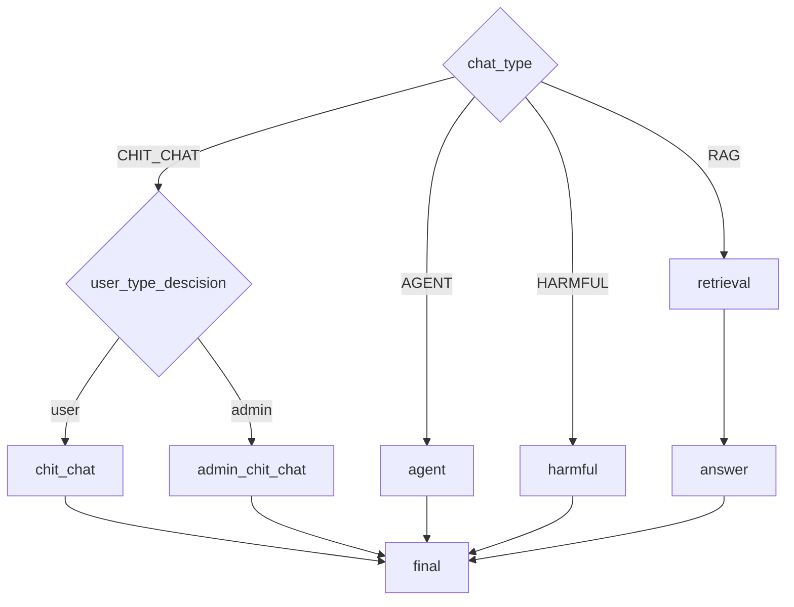

# test

```mermaid
graph TD
    chat_type{"chat_type"}
    chat_type -->|RAG| retrieval
    chat_type -->|CHIT_CHAT| user_type_descision
    chat_type -->|AGENT| agent
    chat_type -->|HARMFUL| harmful
    user_type_descision{"user_type_descision"}
    user_type_descision -->|user| chit_chat
    user_type_descision -->|admin| admin_chit_chat
    chit_chat["chit_chat"]
    chit_chat --> final
    admin_chit_chat["admin_chit_chat"]
    admin_chit_chat --> final
    agent["agent"]
    agent --> final
    harmful["harmful"]
    harmful --> final
    retrieval["retrieval"]
    retrieval --> answer
    answer["answer"]
    answer --> final
    final["final"]
%%    classDef startNode fill:#90EE90
    class chat_type startNode
%%    classDef endNode fill:#FFB6C6
    class final endNode

```
